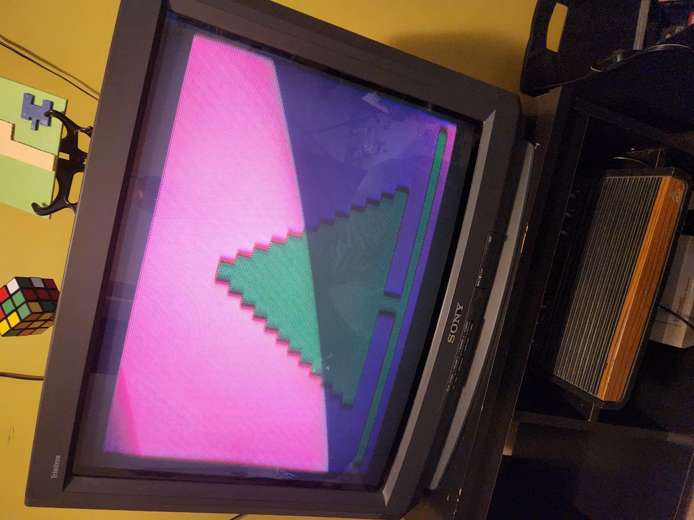

# Atari VCS

Growing up with titles like Combat, Breakout, Space Invaders, and Asteroids in the late 1970s and early 1980s, this project blends childhood memories with hands-on 6502 assembly coding. Inspiration came from attending the Central Ohio Retro Gaming Society convention in 2022, where industry veterans shared their experiences developing for the platform.

The toolchain includes DASM assembler, Stella emulator for testing, and resources like the Pikuma course and 8bitworkshop for interactive development. Also working on transferring images to real EEPROMs, but still getting that workflow nailed down.

Currently features one demo, with more demos and possibly a game or two planned.

**Links:**
- [GitHub Repository](https://github.com/cdeever/atari-vcs)
