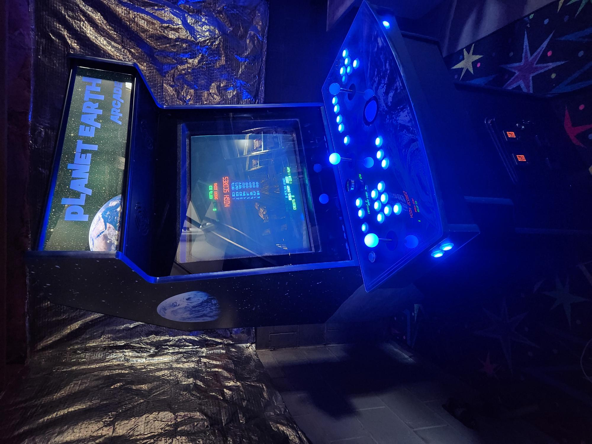

# Planet Earth Arcade

This upright arcade cabinet project is based on a North Coast Custom Ultimate Arcade II upright cabinet. The theme was inspired by the Planet Earth Arcade that operated in Kenton, Ohio in the early 1980s. The machine features custom Earth and space themed artwork, RGB buttons, and an authentic 29" CRT.

Inside, it still runs Windows XP with Hyperspin as the navigator, selecting from a library of games from the late 70s and 80s.
