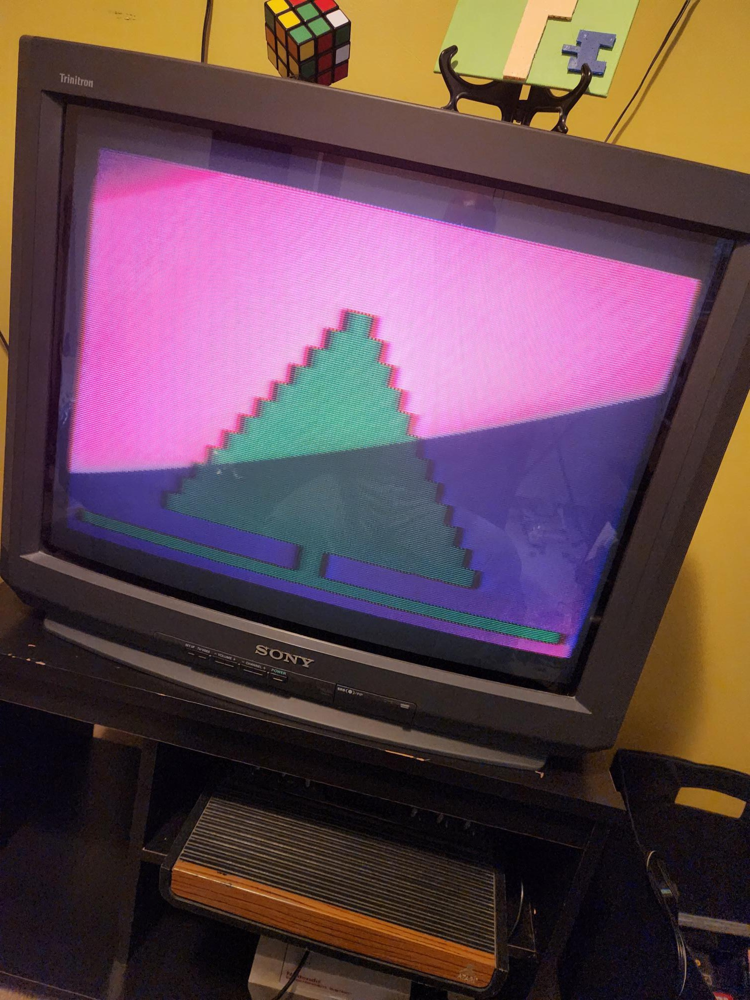
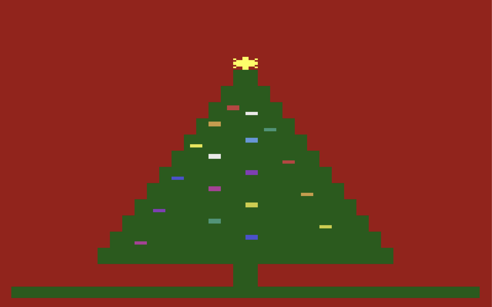

Growing up with Combat, Breakout, Space Invaders, and Asteroids in the late '70s and early '80s, I've always had a soft spot for the Atari VCS. After attending the Central Ohio Retro Gaming Society convention in 2022 and hearing industry veterans talk about developing for the platform, I decided to learn 6502 assembly myself. The ultimate goal is a homebrew game — complete with burned EPROM, cartridge, and label art. The Christmas demo is the first real milestone on that path.

## The idea

I want to know enough 6502 assembly to create a complete homebrew Atari VCS game from scratch — code, cartridge, and labeling. I enrolled in a Pikuma course on Atari 2600 assembly programming to get started, and the Christmas demo was an approachable target given how far I'd gotten in the coursework.

## What I did

The toolchain is DASM assembler and Stella emulator for testing, with 8bitworkshop for interactive development in the browser. Between the course material, sample code, and advice from an assembly wizard at the local meetup, I put together a Christmas tree demo. Getting it to render correctly on screen was the real challenge — more on that below.

## What surprised me

I went in eyes wide open to the concept of "racing the beam" — on the Atari VCS, there's no frame buffer. Your code runs in lockstep with the television's electron beam as it draws each scanline. You're not rendering to memory and displaying it; you're feeding pixel data to the TV in real time, and if your code falls behind the beam, you get garbage on screen. After many iterations where the code looked logically perfect but the tree rendered as a jumbled mess, my assembly expert friend spotted it immediately: timing problem. Storing the tree pattern in a data structure and reading it back was just too slow for the scanline timing. The code was correct — it just couldn't keep up with the beam.

## Result

For last Christmas, I wanted the demo running on a real Atari. I haven't yet nailed down the EPROM programming workflow, so for now I copied the binary to an SD card running through a Harmony cartridge to get it on real hardware. It's a bit of a cheat, but it's a stepping stone toward the ultimate goal of burning the ROM onto an actual EPROM chip. I'll be back to elaborate on the EPROM side of things once I have the whole story. But for now, I'll relish in the satisfaction of seeing my code running on the VCS and showing on the Trinitron!

## Enhancements

The first version was just the tree. Since then I've given it the holiday touches it was missing — a star, lights, and a song — and this is what it looks like now running in Stella:

**The star.** A little starburst sits on top of the tree and twinkles, changing color every frame so it shimmers instead of sitting there as a flat yellow blob.

**The lights.** Twenty colored bulbs blink on and off across the tree. Getting them there was the fun part: my first attempt nearly filled the entire cartridge, because each bulb was positioned by hand with a long run of do-nothing filler instructions — page after page of code whose only job was to waste a precise sliver of time. Working through it with Claude, we replaced all that repetition with one small routine and a short table listing each bulb's position and color. Same twenty blinking lights, but it freed up about a quarter of the whole cartridge.

**The song.** The tree now plays a carol — and if your ear tells you it's a little out of tune, your ear is right. That one isn't on me; it's the Atari's sound chip. The TIA can only produce 32 fixed pitches, and they're spaced unevenly — bunched close together down low and spread nearly an octave apart up high — nothing like the even steps of a piano keyboard. So for most notes the closest the hardware can get is a bit sharp or a bit flat. That slightly-wrong, slightly-charming sound is baked into the machine; it physically cannot play a proper musical scale. You can pick the least-wrong pitch for each note, but you can't make it perfect — and honestly, that wobble is a big part of why old Atari games sound the way they do.

## Still ahead

The bigger goals are still out in front of me: burning the ROM onto a real EPROM chip instead of leaning on the Harmony cartridge, and eventually turning all of this into a complete homebrew game with a proper cartridge and hand-made label art.

## Takeaways

- "Racing the beam" isn't just a concept — until your logically correct code fails because of scanline timing, you don't truly feel it
- The Harmony cartridge is a great intermediate step for testing on real hardware while the EPROM workflow is still in progress
- Having access to an experienced assembly programmer saved hours of frustration — some bugs only make sense to someone who's seen them before
- 8bitworkshop's interactive browser environment is invaluable for quick iteration

## Links

- [Check out the code](https://github.com/cdeever/atari-vcs)
- [Check out the Atari Notebook](https://cdeever.github.io/atari-vcs/)
- [Pikuma — Learn 6502 Assembly with Atari 2600 Games](https://pikuma.com/courses/learn-assembly-language-programming-atari-2600-games)
- [8bitworkshop](https://8bitworkshop.com/)
- [Harmony Cartridge](https://harmony.atariage.com/)
- [8-Bit Classics](https://www.8bitclassics.com/)
