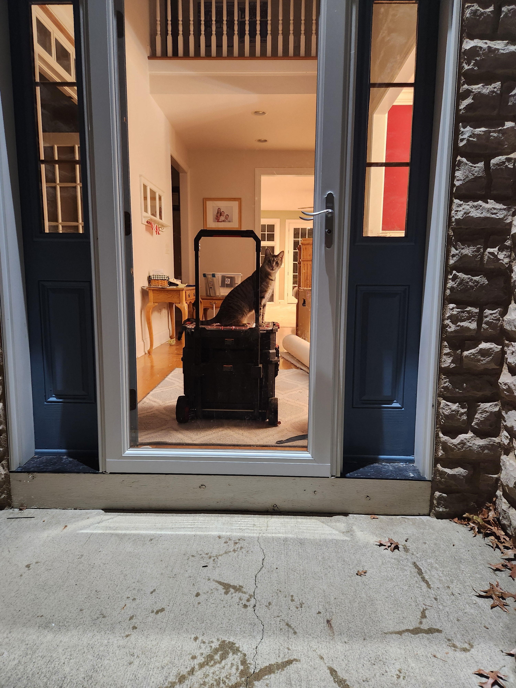
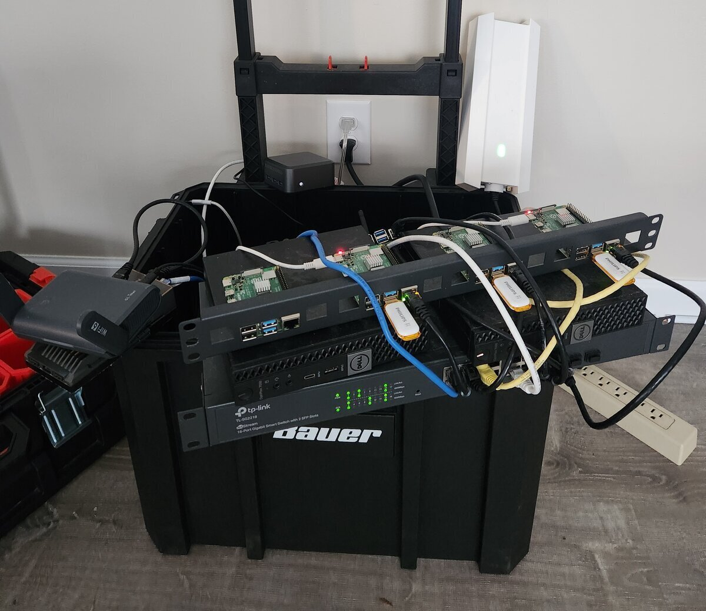

Deevnet Mobile is my portable electronics development lab — where I can pack up the home lab and take it to a Meetup or over to my Sweetie's house for my nerding adventures. It started as a way to get a consistent network for my embedded programming projects and turned into a compact, fully functional infrastructure platform that can go wherever I go.

## The idea

Working with microcontrollers and IoT devices that need to talk to each other or reach the internet means you need a real, consistent network — not just your laptop's hotspot. I joined a local Meetup group for embedded programming and thought: why not bundle a portable home lab into a toolkit alongside my breadboards and microcontrollers, so I can work on IoT projects on the go?

The vision was a portable development lab with real networking — something I could carry to a Meetup and have a proper infrastructure environment wherever I am. A travel router on the edge, a gateway handling DNS and DHCP, a managed switch with VLANs, and a couple of compute nodes. Everything compact enough to fit in a rolling toolbox.

## Constraints

I wanted to keep the build reasonably inexpensive and physically lightweight. That meant refurbished small-form-factor hardware and single-board computers rather than rackmount gear. The network switch needed VLAN support, so a smart switch was required, but everything else was chosen for cost and portability.

## The rig

The physical hardware stack is compact: a travel router on the edge to interface with whatever upstream internet is available, a dual-NIC Zimaboard configured as the gateway handling DNS, DHCP, NAT, and Wake-on-LAN for easy startup, a 16-port smart switch, and two refurbished small-form-factor desktop PCs running Proxmox — one for the management plane, one for tenant applications.

## What surprised me

It turns out my Sweetie's cat likes to jump on top of the rolling kit and ride around. You'd think a cat would be afraid of this kind of thing, but not Zeke — he jumps on and goes for a ride almost every time I bring it over.

## Current state

The mobile lab is functional and ready for portable development. It also serves as a development platform for my home infrastructure, which I'll eventually build out as another automation platform — both managed from the same codebase. The automation that makes the whole thing rebuildable from code is its own project — see [Deevnet Build Automation](https://deevnet.github.io/deevnet-docs/).

The rolling toolbox has an interchangeable tool kit design — I have several component layers for different projects, and a crate module that can bring more extensive tooling like a portable oscilloscope, meter, and soldering gear.

## Future ideas

Version 2 would make the compute portion more modular — keep the travel router, core router, switch, and wireless as a "LAN to go" base layer, then mix and match what rides along: add in the hypervisors when needed, or swap in a bank of Pis instead. A common AC-to-DC power supply would also be a nice upgrade over the current power strip and wall wart mess. Just ideas for now — it's working great as is.

## Links

- [Check out the docs](https://deevnet.github.io/deevnet-docs/)
- [Check out the code](https://github.com/deevnet)
- [Harbor Freight Modular Rolling Toolbox](https://www.harborfreight.com/modular-rolling-toolbox-58512.html)
- [GL.iNet Travel Routers](https://store-us.gl-inet.com/collections/travel-routers)
