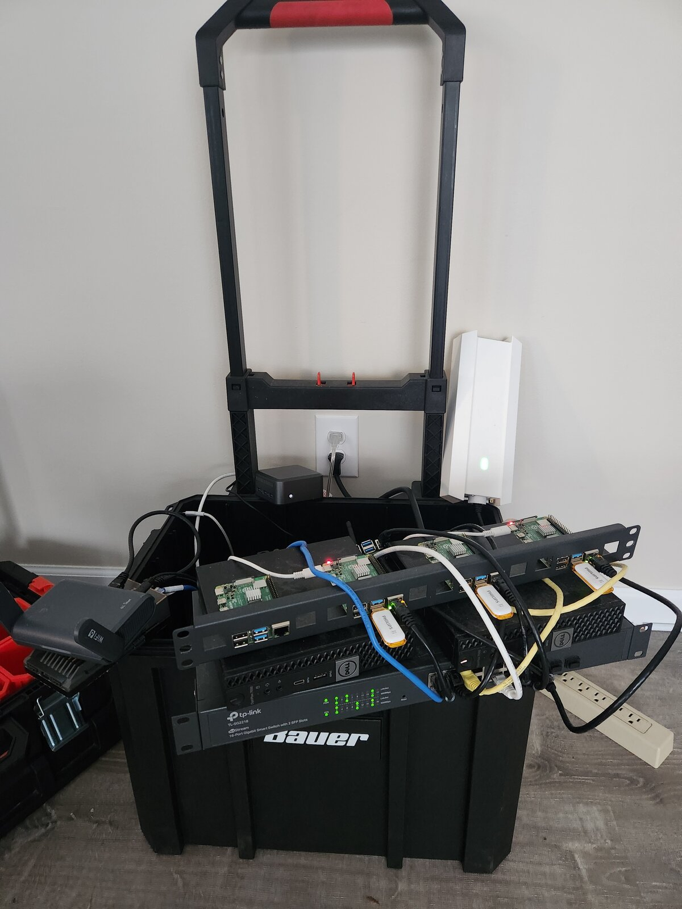

Deevnet Mobile is a portable electronics development lab — a home lab you can pack up in a rolling toolbox and take to a Meetup. It started as a way to get a consistent network for embedded programming projects and turned into a compact, fully functional infrastructure platform that goes wherever I do.

## The idea

Working with microcontrollers and IoT devices that need to talk to each other or reach the internet means you need a real, consistent network — not just your laptop's hotspot. I joined a local Meetup group for embedded programming and thought: why not bundle a portable home lab into a toolkit alongside my breadboards and microcontrollers, so I can work on IoT projects on the go?

The vision was a portable development lab with real networking — something I could carry to a Meetup and have a proper infrastructure environment wherever I am. A travel router on the edge, a gateway handling DNS and DHCP, a managed switch with VLANs, and a couple of compute nodes. Everything compact enough to fit in a rolling toolbox.

## Constraints

I wanted to keep the build reasonably inexpensive and physically lightweight. That meant refurbished small-form-factor hardware and single-board computers rather than rackmount gear. The network switch needed VLAN support, so a smart switch was required, but everything else was chosen for cost and portability.

## The rig

The physical hardware stack is compact: a travel router on the edge to interface with whatever upstream internet is available, a dual-NIC Zimaboard configured as the gateway handling DNS, DHCP, NAT, and Wake-on-LAN for easy startup, a 16-port smart switch, and two refurbished small-form-factor desktop PCs running Proxmox — one for the management plane, one for tenant applications.

## Current state

The rig is built and functional. The platform exists in two deployments: Deevnet Mobile (the portable lab) and Deevnet Home (permanent home infrastructure), both managed from the same codebase. The automation that makes the whole thing rebuildable from code is its own project — see [Deevnet Mobile Substrate Automation]().

## Links

- [Check out the docs](https://deevnet.github.io/deevnet-docs/)
- [Check out the code](https://github.com/deevnet)
