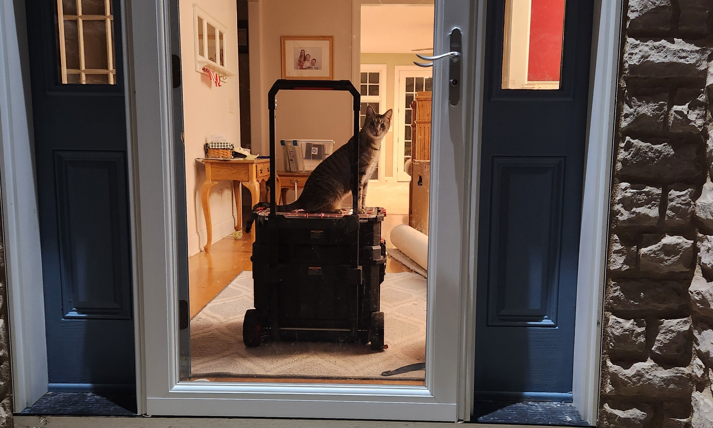
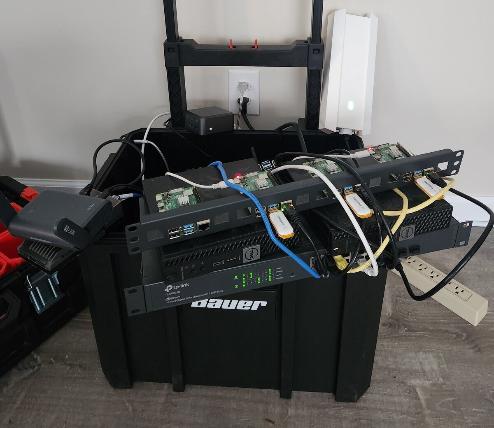

The Mobile Factory started as my portable home lab — a way to pack up a real network and take it to a Meetup or over to my Sweetie's house for my nerding adventures. It has since pivoted into Deevnet IoT as a Service: a cloud you can carry. I roll it into a [CARPE](https://carpe-tech.org) meetup, set it up, and everyone in the room gets a network for their devices, MQTT messaging, and logs and dashboards — all declared from their own Terraform, with no public cloud. It works today, and I'm still building out the tenant side.

## The idea

Working with microcontrollers and IoT devices that need to talk to each other or reach the internet means you need a real, consistent network — not just your laptop's hotspot. I'm a member of the [Columbus Arduino and Raspberry Pi Enthusiasts](https://carpe-tech.org), and I wanted to build things on site at meetups. That meant bringing my own network, so I bundled a portable home lab into a toolkit alongside my breadboards and microcontrollers.

That was version one, and it was just for me. Then I started thinking about everyone else at the table. Everybody wiring up sensors spends the first chunk of the evening on the same plumbing — where do the messages go, where do the logs go, how do I see what my device is doing. I built the thing for my own projects, and then I wanted to make it something everyone else could use too.

## Constraints

I wanted to keep the build reasonably inexpensive and physically lightweight. That meant refurbished small-form-factor hardware and single-board computers rather than rackmount gear. The network switch needed VLAN support, so a smart switch was required, but everything else was chosen for cost and portability.

The pivot added a couple more. It has to work offline once it's set up, because venue Wi-Fi is never something to count on. And there's no public cloud: nobody signs up for an account, and nothing leaves the room.

## Design approach

The model is "tenants." Each person (or team) at the meetup is a tenant, and a tenant describes what it needs in its own Terraform. From that it gets:

- Its own Wi-Fi key on the IoT network, issued by the platform — I don't have to touch the controller for each person.
- MQTT, with a broker account per device, scoped to the tenant's own topics.
- Logs from its devices and workloads that only it can read, and its own Grafana to chart them.
- Its own isolated network, DNS zone and storage for anything else it wants to run.

I made the messaging and logging decisions up front on purpose. The point is to spend the evening on your devices and what they do, not on standing up a broker.

## Building the thing that builds the thing

Like a typical engineer, I couldn't just build the thing. First I had to build the thing that builds the thing. The network, the services and the OS images the factory runs are all automated and built from code — Ansible, Packer, Terraform and PXE — and everything can be rebuilt from scratch. That's why I call it a factory. Somewhere along the way it also became a reference implementation for infrastructure automation, with docs written to be read by people and AI agents alike.

It also produces things people take away. Its address space and DNS zone travel with the toolkit, so it's the same factory wherever I set it up — no renumbering. And it builds a take-home kit: bring a microSD card, and you can walk out with your backend running on a Raspberry Pi of your own.

## The rig

Everything lives in the base of a Bauer modular rolling toolkit. On the edge, a GL.iNet Slate AX travel router picks up whatever upstream internet is available. Behind it, a dual-NIC ZimaBoard runs OPNsense as the core router — firewall, DNS, DHCP and gateway. Then a 16-port smart switch, a wireless access point for the IoT network, two refurbished small-form-factor PCs running Proxmox — one for the management plane, one for tenant workloads — and a bank of Raspberry Pi 4s.

The rest of the toolkit is an interchangeable tool kit design — I have several component layers for different projects, and a crate module that can bring more extensive tooling like a portable oscilloscope, meter, and soldering gear. So the breadboards, parts and tools come on site with the factory, ready for hardware hacks and prototyping.

## What surprised me

It turns out my Sweetie's cat likes to jump on top of the rolling kit and ride around. You'd think a cat would be afraid of this kind of thing, but not Zeke — he jumps on and goes for a ride almost every time I bring it over.

## Current state

The factory is working: tenants can get on the network, publish MQTT from their devices, and chart their logs in their own dashboards. The docs have a walkthrough for everything a tenant needs, from what to have on your laptop before you come to taking your backend home on a Pi.

**If you're local to Columbus, Ohio**, come to a [CARPE](https://carpe-tech.org) meetup. Bring your breadboard, microcontrollers and sensors, plus a laptop and a microSD card, and you can prototype a multi-device project with the backend already running. **If you're not local**, the code and docs are open — use them and adapt them for your own lab, or have your favorite AI agents adapt them for you.

## What's next

Windows laptops are the next gap. Today a tenant needs macOS or Linux, because the Terraform provider is only prebuilt for those and the install scripts are bash, so I'm adding Windows builds and a PowerShell installer.

Further out, I'd still like to make the compute more modular — keep the router, switch and wireless as a "LAN to go" base layer, then mix and match what rides along. A common AC-to-DC power supply would also be a nice upgrade over the current power strip and wall wart mess.

## Links

- [Check out the docs](https://deevnet.github.io/deevnet-docs/)
- [Check out the code](https://github.com/deevnet)
- [Columbus Arduino and Raspberry Pi Enthusiasts (CARPE)](https://carpe-tech.org)
- [Take It Home on a Pi](https://deevnet.github.io/deevnet-docs/docs/runbook/tenant/take-it-home/)
- [Harbor Freight Bauer Modular Rolling Toolbox](https://www.harborfreight.com/modular-rolling-toolbox-58512.html)
- [GL.iNet Travel Routers](https://store-us.gl-inet.com/collections/travel-routers)
