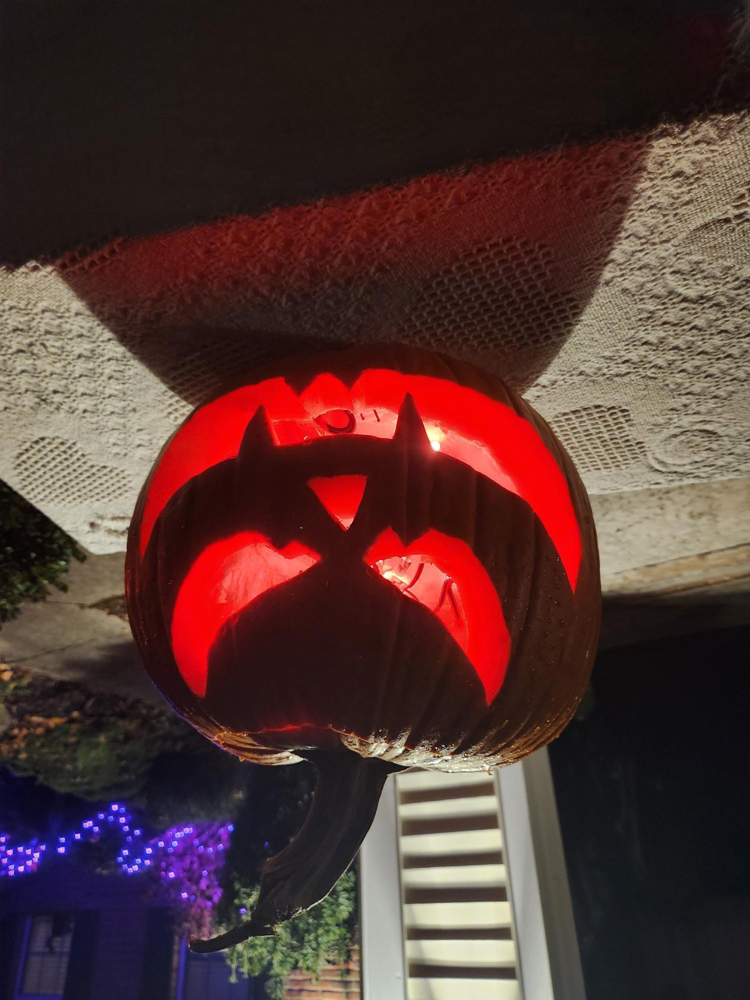

A Halloween pumpkin powered by an ESP32 — flickering flame LEDs at idle, then a strobe and evil laugh triggered by motion when trick-or-treaters walk up. Built in C with ESP-IDF and FreeRTOS, inspired by a Bitluni YouTube video that made it look easy. It was not easy, but it works great.

## The itch

I stumbled across a project video by Bitluni where he built a screaming pumpkin for Halloween. He whipped it up in a couple of hours with some leftover parts and it looked cool and easy enough for a beginner like me. I figured I'd spin up my own version with a few twists — an evil laugh instead of a scream, and a nice flickering flame effect at idle.

## What I did

An ESP32 drives a strip of WS2812B LEDs for a realistic flickering flame effect inside the pumpkin. A PIR motion sensor detects approaching trick-or-treaters and triggers a strobe effect plus an evil laugh played through I2S audio. The whole thing is written in C with the ESP-IDF framework, using FreeRTOS to run the LED animation and audio playback as separate tasks. Different sounds can be swapped in for variety.

## What surprised me

It took a lot more than a few hours — even with vibe coding. FreeRTOS timing was tricky. Getting the motion trigger, strobe effect, and audio playback to all fire at the right time required many rounds of tweaking. The tasks needed careful coordination to avoid stepping on each other. But after enough iteration it finally ran perfectly, and the idle flame effect actually looks great.

## Result

Fully working. The pumpkin looks fantastic at idle with the flickering flame, and the motion-triggered strobe plus evil laugh gets a solid reaction from trick-or-treaters. Future plan: build two more in different size pumpkins, each with their own voice, for an evil pumpkin family.

## Takeaways

- The ESP32 is a remarkably capable little board for the price
- FreeRTOS is impressive — real multitasking on a microcontroller — but the timing coordination has a real learning curve
- "A couple hours" on YouTube can easily become days in practice, and that's fine
- Vibe coding gets you started fast but embedded timing issues still require hands-on debugging

  
  

## Links

- [GitHub Repository](https://github.com/cdeever/esp32-pumpkin)
