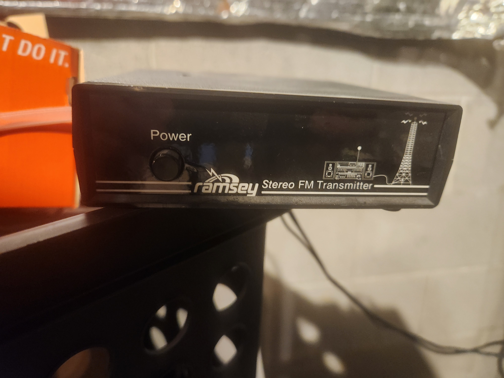

A Ramsey FM transmitter kit, soldered by hand and wired to a dipole antenna in the attic, that turned a basement WinAmp music server into a neighborhood radio station. Friends could request songs from a flip phone and hear them on any nearby FM radio. Built in the late 2000s, before Bluetooth speakers existed.

## The idea

Back in the late 2000s, before Bluetooth speakers and when flip phones were still the rage, I had a rig for on-demand music. Hanging out in my neighbor's garage, my buddy could say "play Van Halen" and out of the FM boom box would come Van Halen. I was the neighborhood DJ, ready to play all the classic rock tunes on weekends in the garage, driveways, or around firepits — all from a flip phone, over the air to anyone's FM radio nearby.

For my home music server I was running WinAmp, and it supported a skinnable plugin called BrowseAmp. With a mobile skin that was actually pretty navigable on a flip phone, I exposed the site via a reverse proxy where I could select artists, albums, or single songs to play or queue up. All I needed was a way to get the music playing in my house over to my neighbors. That's when I found the Ramsey FM Transmitter kit. I ordered it and it came with all the parts to run a small radio station.

## What I did

Over the course of several sessions I worked to get all the components soldered onto the board. I hadn't done that much soldering since the time I was a kid in my basement messing around with random parts from Radio Shack — not really accomplishing much other than making a mess. But I carefully soldered all the components in place and then came the moment of truth: apply power and test it out.

I connected the transmitter to a source and powered it on. On the radio, I scanned the dial and found an empty slot — 102.7 FM, nothing but static. Then I started turning the transmitter's tuner toward that spot on the dial, and — much to my surprise — it actually worked. Boom. My stuff coming through crystal clear on 102.7.

I ran coax cable all the way to the attic and put a simple dipole antenna up there, with the transmitter connected to my audio system in the basement.

## What surprised me

The range was better than I expected. The next-door houses were all in pretty clear range, but I tested reception from my car and found I could still hear faint signals about a mile away — not listenable, but it was there. My house and the nearby houses were good enough for weekend parties.

## Result

It worked great. The whole setup — WinAmp with BrowseAmp, the flip phone as a remote, the Ramsey transmitter broadcasting to the neighborhood — came together into something genuinely useful and fun. Once in a while if we were away, the neighbors would ask me to leave the site on so they could use it in our absence. Absolutely!

## 102.7 FM Today

When Bluetooth speakers became all the rage and anyone with Spotify could play any song, my FM rig sadly became obsolete. No one needed it anymore — they had the same function in their pocket, and my giant MP3 collection wasn't as complete as the online streaming services.

But alas, I have a modern use case. I scored a vintage GE ghetto blaster on eBay nicknamed "The Judge," and the FM transmitter now supplies my home music collection to The Judge when I'm either in the garage or playing games on the [Planet Earth Arcade](../planet-earth-arcade/) machine. There's something about 80s music coming through a real 80s boombox over FM that a Bluetooth speaker just can't replicate — it sounds exactly the way it was meant to be heard. The combo is also a hit on Halloween — The Judge blasting Halloween-themed songs from the driveway during trick-or-treat. My fellow Gen X parents love it. The transmitter has been powered on for most of its life and it still works as good as the day I first assembled it.

## Takeaways

- Sometimes the best tech solutions are the ones your neighbors ask you to leave running when you go out of town
- Good hardware outlasts the software ecosystem around it — the transmitter is still going strong nearly two decades later

## The rig

