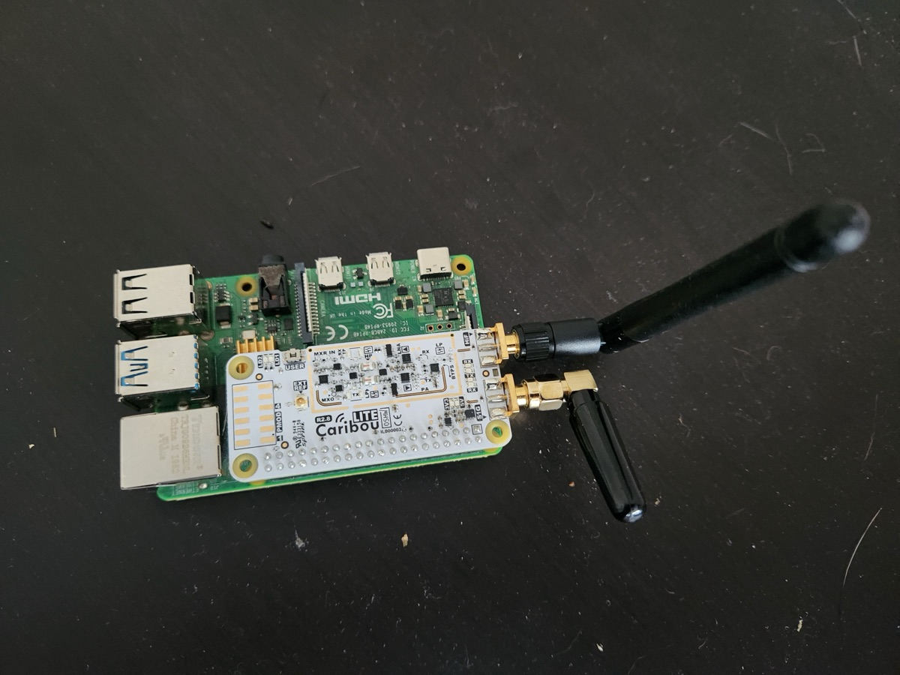

A Raspberry Pi image purpose-built for the CaribouLite software-defined radio HAT. Rather than manually configuring each SD card, this project uses Packer and Ansible to produce a reproducible image with all the SDR drivers, kernel patches, and boot configuration baked in — part of the Deevnet image factory. Flash a card, boot it up, and you're ready for RF experimentation.

## The idea

I came across [Jeff Geerling demonstrating the CaribouLite SDR HAT](https://www.youtube.com/watch?v=Hz2WqhWmjZE), and for me this was the first time seeing a software-defined radio in action. I've had an interest in radio tech and the HAT looked cool to try out. As it turned out, the setup was very complicated — kernel patches, boot configuration changes, driver builds — and I wanted to capture all those steps in code so it would be easy to rebuild if needed. Since this was a Raspberry Pi, it was a natural fit for the Deevnet image factory.

## What I did

I knew Packer could build Pi images on x86 even though the target is ARM, and I knew Ansible could apply configuration to an image before it's sealed up. So the plan was straightforward: Packer builds the base Raspbian Bookworm image, Ansible provisions the CaribouLite SDR configuration in a chroot, and out comes a flashable image. That was the plan, at least.

## What surprised me

The build turned out to be significantly more complicated than expected. Even with Claude Code driving, the pipeline needed Podman to isolate the ARM image build from the Fedora host — running Packer with qemu-user-static for cross-architecture emulation inside a container. On top of that, the CaribouLite drivers required kernel patches across multiple Linux 6.x API changes — different fixes for 6.3, 6.4, and 6.12+ — and the Ansible provisioning had to run in an offline chroot against the image rather than a live system. What started as "automate the install steps" turned into a four-stage pipeline with container isolation, cross-compilation, kernel patching, and chroot-based configuration management.

## Result

In the end, the image builder works — albeit not exactly as originally envisioned. Setting up the SDR from scratch is now just three steps: make the image, boot it with the HAT connected and run the setup, then run the validation test. More importantly, this build helped me see a good pattern — image plus first-boot setup plus embedded documentation and tests baked right into the image. That pattern will be applied to future Pi projects for sure.

## Takeaways

- Finishing the SDR image is just the beginning of the radio journey. After setting up the client, there's a whole world of radio to learn — the end of the image journey is just the start of the SDR journey.
- Packer + Ansible + Podman is a viable pipeline for cross-architecture Pi image builds, but expect more complexity than a native build.
- Baking a readme and validation tests into the image itself is a pattern worth reusing — the image becomes self-documenting.
- Kernel module builds across Linux versions are a moving target. Protecting patches with `git update-index --skip-worktree` keeps upstream pulls from clobbering your fixes.

## The rig

## Links

- [Jeff Geerling — CaribouLite SDR HAT](https://www.jeffgeerling.com/blog/2025/cariboulite-sdr-hat-sdr-on-raspberry-pi/)
- [Check out the code](https://github.com/deevnet/deevnet-image-factory)
- [CaribouLite](https://github.com/cariboulabs/cariboulite)
- [CaribouLite RPi HAT on Crowd Supply](https://www.crowdsupply.com/cariboulabs/cariboulite-rpi-hat)
