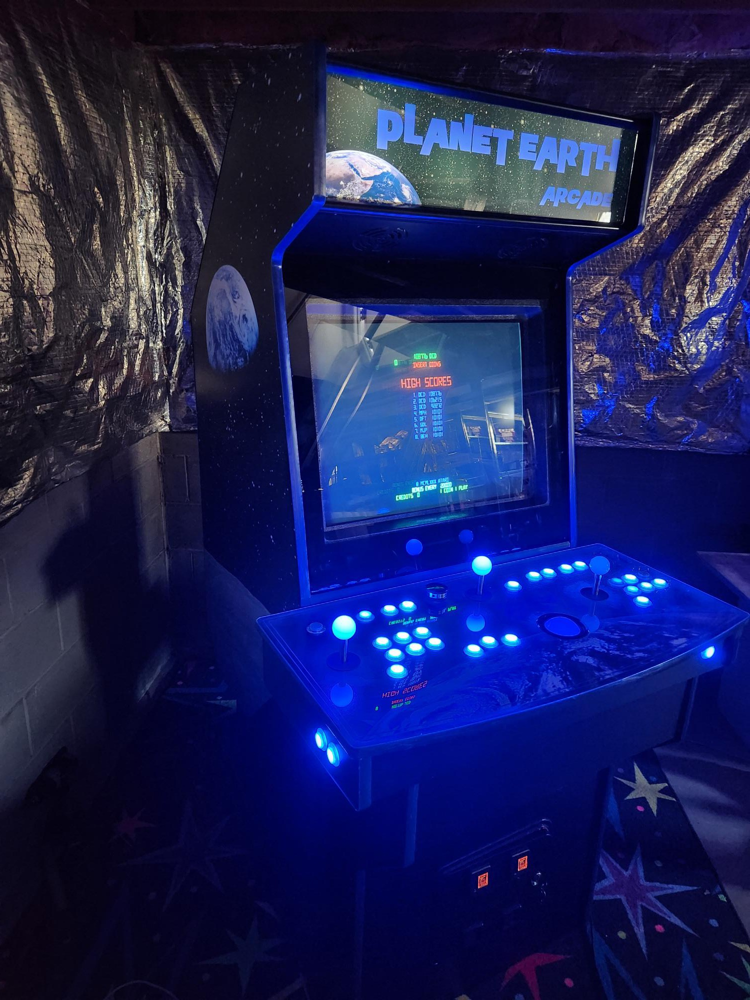

A full-size upright arcade cabinet built from a North Coast Custom Ultimate Arcade II kit, themed after the Planet Earth Arcade that operated in Kenton, Ohio in the early 1980s. The machine features custom Earth and space themed artwork, RGB buttons and joysticks, a spinner, trackball, and an authentic 29" CRT. Inside, it runs Windows XP with Hyperspin as the navigator, selecting from a library of classics from the late 70s and 80s.

## The idea

As a member of Gen X growing up in the 70s and 80s, the golden age of arcades was all around — and I was old enough to ride my bike to Planet Earth Arcade with a pocket full of quarters. All the classics were there: Asteroids, Space Invaders, Pac-Man, Frogger, Donkey Kong — you name it. If current me could have told young me "One day you'll have this in your house," I might have said — Wow!! Really?!! How?!!

Ever since seeing MAME running on a PC, faithfully reproducing the old games in their perfect form, I knew I needed to recreate that experience in my own cabinet — and Planet Earth, as an homage to my childhood hometown arcade, was the perfect theme. By 2010, CRT manufacturing was winding down, so if I wanted to build a new arcade cabinet with an authentic CRT, it was now or never.

## Design approach

I looked online and saw a lot of different cabinet designs — some were great, some were not so great. I wanted to build one, but I knew with my skills and tool set there was no way I was going to build a custom cabinet that looked like it came straight out of the arcade factory. Then I found North Coast Custom and discovered the Ultimate Arcade II was available as a kit. The UAII also featured a nice design where the keyboard and mouse slide out on a hidden drawer for configuration tasks. Perfect. The control panel layout includes a spinner, trackball, two-player joysticks and buttons — and the RGB buttons and joysticks looked cooler than even the games looked back in the day.

## Build log

**Sourcing.** The cabinet kit gave the machine its shape, but I still needed the CRT, coin door, buttons, joysticks, trackball, spinner, wiring, control board, light controller, sound system, lights, and artwork. I was able to get most everything from [Ultimarc](https://www.ultimarc.com/) and [Suzo-Happ](https://na.suzohapp.com/). A few more odds and ends came from the local Radio Shack and Best Buy — including car speakers to go along with a nice subwoofer, so Space Invaders would make a satisfying thump thump thump as they launch their attack.

**Artwork.** With Planet Earth as the theme, I went with "Planet Earth" in the Planet of the Apes font on a starfield background featuring both the Earth and the Moon — easy enough for my skill level. The Ultimate Arcade marquee and control panel templates were available from a supplier, and I was able to apply the images to the templates in Photoshop for a nice marquee and control panel. I deferred the side art at first since I wasn't sure what I wanted.

**Cabinet assembly.** Lucky for me, my Uncle Pete had a long career in construction, and this many-step build was a nice project for the two of us to work on. We were able to get the cabinet assembled in pretty much one day.

**Components and wiring.** With all the buttons, plus the power on/off, volume control for the speaker system, coin door lighting, and coin activation, there was plenty to wire up. The marquee lighting also had to be tied in to the computer power supply. I found a power strip that worked by detecting power on one device — the computer — and enabling the other outlets to activate, powering the monitor, sound system, and USB distribution. That gave me single-button on/off.

**Software.** Windows XP was still in support at the time and was the OS platform. I looked at a few different front-end programs, but Hyperspin was — and perhaps still is — the best one out there. It supports nice wheel art, a frame for each game when you land on it, and a movie clip of the game with sound effects. It also features an attract mode that randomly bounces between games. Hyperspin works with the light controller software to illuminate only the buttons that are functional for each game. There's a big XML "database" of all the games, so it's just a matter of editing the file to match the game ROMs in the collection. A few Windows tweaks were needed to make it start up and go directly into Hyperspin on boot — no clicking or keyboard necessary, just power on and straight to the games.

## Challenges

Finding joysticks with the RGB lights was not easy. The online suppliers were out of them and weren't getting new stock. I went back to North Coast Custom and they helped me out — they could get them custom made. They looked great, but they didn't fit exactly into the off-the-shelf joystick housings I had. I had to take the plastic washers and make them much thinner so the sticks would fit into the opening. The only way I could think to make the plastic thinner was to sand them down until they fit, which is exactly what I did. Tedious process, but in the end it worked out.

## First power-on

With everything in the cabinet — the lights behind the marquee, coin door ready to light up, and the CRT behind the plexiglass — the machine looks legit. It looks like it would fit right in with any other early 80s cabinet. After launching MAME with one of the games — wow.

## CRT woes

Late in 2018, after about seven years and many, many hours of Millipede and other games, the CRT was exhibiting no signs of life. Many life changes were also happening, and in 2019 I moved to a new house — disassembling the cabinet and getting it relocated was certainly not trivial. After settling into the new house with the CRT in a non-functional state, I had the machine rigged up in a partially assembled state with a temporary flatscreen so I could get my fix, but I dreamed of getting the cabinet restored back to its original glory.

## Rebirth

Lucky me — my Sweetie surprised me on my birthday with cabinet side art. I got the famous Apollo 8 "Earthrise" photo showing Earth from the Moon's perspective, which fit in great with the theme. Now there was a strong reason to get everything put back together.

I found an arcade repair guy who was able to replace the flyback transformer. When I dropped off the monitor, I half-seriously pondered how fun it would be to shadow him as an apprentice helper and learn the tricks of the CRT trade. The repair ended up costing more than the original CRT and sacrificing some poor Golden Tee out there somewhere.

With the working CRT back home, it was time to rebuild — and while refreshing everything, why not go ahead and upgrade to Windows 10? Well, Windows 10 dropped support for 800x600 resolution — which means it wasn't going to work with the CRT. So Windows XP is the forever OS. I have to tip my hat to Microsoft for still providing a path to activate Windows XP after a fresh install so many years after end-of-life.

With the machine all back together and better than ever, I ordered a blacklight-style rug for the grand reopening and even got a cheap starfield projector for full lights-out special effects during a gaming session.

## What's next

The machine is running great as-is. Running XP is perfect — exactly configured and ready anytime for a quick session of Galaga, Ms. Pac-Man, Tempest, or any number of other classics — transporting me right back to Planet Earth in Kenton, 1981.

## The finished machine

## Links

- [Ultimarc](https://www.ultimarc.com/)
- [Suzo-Happ](https://na.suzohapp.com/)
- [HyperSpin](https://hyperspin-fe.com/)
- [HyperAI Docs](https://docs.hyperai.io/)
- [EmuMovies](https://emumovies.com/)
- [MAME](https://www.mamedev.org/)
- [T-Molding](https://www.t-molding.com/)
- [North Coast Arcades](https://www.northcoastarcades.com/) — 😢 It appears North Coast Arcades is no longer in business, but the site is still active for reference.
