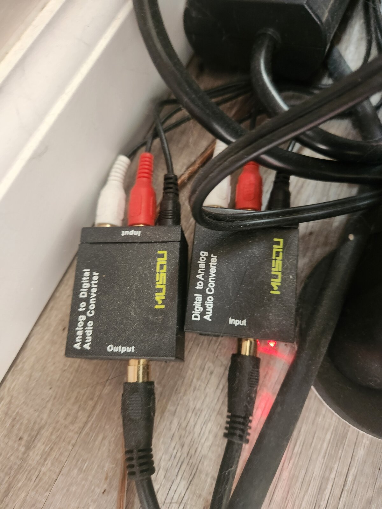

A whole-home digital audio system built on SPDIF over repurposed CATV coax. A basement media server streams to vintage hi-fi systems in multiple rooms, and when a record drops on the turntable, it automatically takes over every zone. The system is up and running daily — one upstairs room still needs an active splitter for reliable signal, but everything else just works.

## The idea

I've always been a music listener — always have been, probably always will be. I love hearing music on vintage gear from the '70s and '80s, and while I'm a vinyl aficionado, I also appreciate the convenience of digital and streaming. I wanted the best of both worlds: high-quality digital audio in any room of the house — or even outside — just by turning on the system in that room. And if a record is playing, I wanted it to follow me through the house just as easily. Put the record on, and it's everywhere.

## What I did

It starts with a media server in the basement running iTunes, Spotify, and Tidal. iTunes and Spotify are remote-controllable from my phone or any computer over RDP; Tidal requires remoting in directly but offers the highest streaming quality. The SPDIF output from the sound card feeds into an automatic digital A/B switch that can override one channel with another when a signal is present.

From there, the digital output is split and sent over repurposed CATV coax lines to each room. The master bedroom has a vintage Marantz system, and another bedroom runs an '80s-era Carver setup that lines up pretty close to Ferris Bueller's system in his Day Off movie. The family room home theater takes a direct SPDIF input, and an old receiver in the basement feeds speakers outdoors. There's even an output to the [FM transmitter](../fm-transmitter/) so I can listen on the '80s-era ghetto blaster while playing arcade games or working in the garage. Each system has a DAC that feeds into aux for perfectly clean audio.

Now for the vinyl side — and this is where it feels like magic. In my living room office, I have my Onkyo system with the amp I bought as a high schooler, and this is the primary system for spinning records. An ADC on the turntable output activates only when the turntable is powered on, digitizes the signal, and sends it back to the basement over coax. There, it feeds into the digital A/B switch and automatically overrides the media server input. So when a record is playing, it takes over every room — no button presses, no app switching, just music.

## What surprised me

When I first tried splitting the SPDIF signal, I didn't expect it to reach multiple rooms — especially upstairs — but it did. Originally I was splitting analog out of the media server with passive splits and ADCs on each line. When I moved to an all-digital backend, one of the upstairs rooms became hit or miss on signal reliability. I'll eventually build an active SPDIF splitter to send an amplified signal upstairs. In the meantime, I have a workaround with an extra ADC just to keep that room reliable.

## Result

The system works and it's highly convenient. I can have a record playing, move on to tasks around the house, and just turn on the system in whatever room I'm in — the music is never far away. Cleaning to '80s hair metal happens at double speed. For Dark Side of the Moon night listening in the bedroom, there's zero static from the high-fidelity streaming. It just works.

## Takeaways

- SPDIF is more resilient than I expected — it carried signal through passive coax splits to multiple rooms, though the move to an all-digital backend did cut signal strength enough to matter on the longest run
- Bang for the buck, you'd have to spend hundreds or maybe even thousands to match this with a commercial digital streaming system
- A Sonos setup might have a slight edge with its digital delay synchronization between rooms, but repurposing the existing CATV coax lines gets you there for not a lot of money

