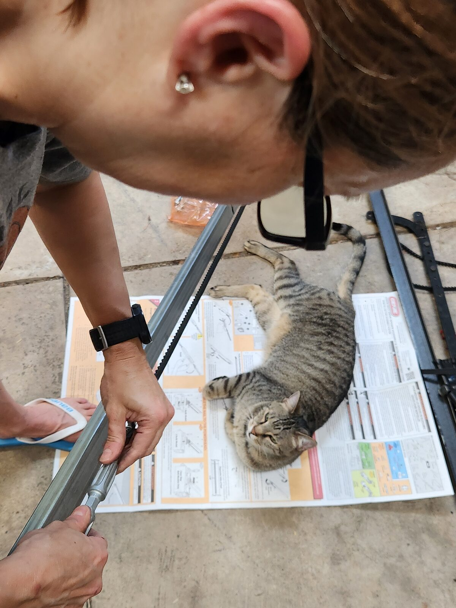

Sweetie's garage door opener died out of nowhere — working fine one day, completely dead the next. What should have been a simple opener replacement turned into a multi-session adventure involving wrong-sized rails, a full remount, missing attic access, and wire splices. The door works great now, and the story is better than the repair.

## The situation

One day Sweetie's garage door just stopped. No warning signs, no weird noises leading up to it — just fine one day and nothing the next. The opener wouldn't respond to the wall button or the remote. Completely dead.

I had set her up with a remote control system so she could disable the door when needed. Her cat Zeke likes to hang out in the garage, and if someone comes home and hits the opener, Zeke could be out and long gone before anyone notices. The remote let her lock out the door when Zeke was doing his garage thing. In hindsight, though, putting the opener's power through a remote switch may not have been the best idea. The switch was rated at 15 amps, so on paper it should have been fine. But garage door openers are motor loads — inductive, not resistive. Every time you break the circuit on a motor, the collapsing magnetic field produces a voltage spike that arcs across the switch contacts. And every time the motor starts back up, the inrush current can be five to eight times the running current. A 15-amp resistive rating doesn't mean much when you're switching an inductive load hundreds of times. Over months of daily enable/disable cycles, that kind of abuse pits and degrades the contacts until something gives. That may well be what killed it.

## Why it mattered

Sweetie needed her garage door working. It's her main way in and out, and without it she was stuck using the front door and manually dealing with the heavy garage door whenever she needed to get the car out. Plus the Zeke situation — without the remote system, the whole cat-safety workflow was gone too.

## Initial assessment

My first thought was that something simple had failed — a capacitor, a relay, something discrete that could be swapped. The motor wasn't that old, and the failure was so sudden that it felt like a single component giving up rather than general wear. So we turned to ChatGPT to help walk through the diagnosis.

## The plan

Troubleshoot with ChatGPT's help, identify the failed component, swap it out, and get the door running again without replacing the whole unit.

## The adventure

We started feeding ChatGPT the symptoms — dead opener, no response to any input, power was getting to the unit but nothing was happening. It walked us through some diagnostics and landed on a recommendation: replace the start capacitor.

Sounded reasonable. I ordered the capacitor, swapped it in — nothing. Still dead.

So we went back to ChatGPT. Sweetie was asking it questions too, and this time it came back with a different recommendation — a different capacitor. Not the start capacitor, but the run capacitor this time.

That's when I had my moment.

## The turning point

I accused ChatGPT of deliberately giving me the wrong answer so it could swoop in with the right one for Sweetie. I told it that it was putting the moves on my girlfriend — feeding me bad info so it could be the hero when she asked.

ChatGPT was not having it. It set the record straight in the most matter-of-fact way possible, explained exactly why the two recommendations were different based on the different information each of us had provided, and then ended its response with:

*"We good?"*

We absolutely lost it. That might be the hardest I've laughed at an AI response. The confidence. The directness. The slight attitude. Perfect.

## The fix

The second capacitor didn't fix it either. At that point we'd spent enough on parts and had exhausted the reasonable DIY component-level repairs. Sweetie decided to just buy a new opener and we'd install it ourselves.

Here's lesson number one that we learned the hard way: if your old opener's brand and model are still available, just buy the same one. Same mounting points, same rail length, same hardware — swap it in and you're done. Neither of us did that homework. We just picked up a new opener and figured we'd sort it out.

### Assembly and the first surprise

As with many of our projects, Zeke was right in the middle of things — in this case, literally lying on the instruction manual while Sweetie was trying to read it. Helpful as always.

We assembled the new opener and immediately noticed the problem — the rail was noticeably shorter than the old one. That's when the after-the-fact research began. Turns out Sweetie's garage door is an 8-footer, not the standard 7-foot door. The opener we bought was spec'd for a 7-foot door.

No big deal, right? They sell extension kits for exactly this situation. Order the extension piece, bolt it on, and the rail will reach. Simple.

Right?

### Still short

We came back for the next session with the extension piece in hand, bolted it on, and went to mount the opener. The rig has plenty of adjustment holes to slide the unit forward and back along the mounting bracket — so we figured we'd just nudge it forward to make up the difference.

Maxed out every adjustment hole. Still short by a few inches.

The extension got us close, but not close enough. There was no getting around it — we were going to have to take down the whole mounting rig and remount it in a new location, closer to the door. That's not a quick adjustment. That's new lag bolts into the ceiling joists, re-hanging the opener, and re-aligning everything from scratch.

And that wasn't the only surprise. Down at the door end, the wall brackets — where the rail connects above the door — were a completely different design from the old ones. The old brackets weren't going to work with the new hardware, so those had to come down and be replaced too. Less effort than relocating the opener rig, but still more work we hadn't planned for.

What started as "swap in a new opener" was turning into a full reinstallation — new ceiling position, new wall brackets, and a lot more time than we'd budgeted.

### The remount

Getting the bracket remounted to the ceiling was tricky — those long lag bolts need to find the center of the studs, and there's not a lot of room for error when you're drilling overhead. But my bigger concern was getting the track perfectly straight and perpendicular to the door. A crooked track means a binding door, and I wasn't about to go through all this just to end up with a rail that fights the door on every cycle.

I broke out the laser level to project a center line down the length of the garage ceiling. Then I used the laser measure to the wall and hung weighted strings to give us a true straight line all the way to the door. Plumb, straight, and square — verified three ways.

I was feeling pretty smug about this approach. Engineer brain fully engaged, and it was working. We got the rig mounted, stepped back, and it looked dead straight. The new wall brackets went in clean. The rail lined up. Everything was coming together.

And then we went to connect it to the electric.

### The chain reaction

Moving the opener forward by a few feet had a knock-on effect we hadn't thought about — the wall switch and safety sensor wires that came down from above no longer reached the new location. Of course they didn't. Every fix on this project created the next problem.

Our first instinct was to do it right — run new wires through the attic and come back down at the new position. Clean, proper, no visible splices. We went up to take a look.

There is no attic. What looks like attic access from the garage is just a few small doors for getting at plumbing. No crawlable space, no way to route new wire runs. So much for doing it the proper way.

We ended up splicing in some additional wire to extend the existing runs to the new location. Not the elegant solution we had in mind, but it got the connections made and everything works. Sometimes "done right" means "done and working."

### The moment of truth

New door sensors installed. Replacement wall switch wired up. Everything connected, everything in place. It was time.

There was real tension in the garage. This had been a long road — two failed capacitors, a wrong-sized opener, an extension kit that wasn't enough, a full remount, no attic, wire splices. Sweetie had been without a working garage door for more than a month as we scraped together time across multiple sessions to chip away at it. And now here we were, standing in front of the wall switch.

Button pressed — and boom. The door rolled up perfectly on the first try.

Sweetie cried. Not a little misty-eyed moment — she was genuinely overwhelmed with emotion. A month of frustration and inconvenience, all the setbacks, all the "just one more thing" moments — and then it just worked. I never would have thought a garage door going up could move someone like that, but here we are. It was beautiful.

{{< carousel images="{sweetie-reading-instructions.jpg,zeke-wall-bracket.jpg,laser-level-alignment.jpg}" aspectRatio="9-16" interval="3000" >}}

## Result

The new opener is working great — and because it's a more modern unit, it came with some nice upgrades. It has online capability to open and close the door remotely, and there's a built-in lock feature that lets us easily disable the door so Zeke doesn't get let out accidentally. In the end, the lock feature we wanted is back and better than before — even if the old remote-disable approach might have been what killed the original opener in the first place.

## Lessons learned

If the same brand and model of opener is still available — just buy it again. You'll save yourself a world of compatibility headaches. We didn't do this and it cost us time, extra parts, and a lot of improvisation.

Switching an inductive motor load through a remote relay hundreds of times is rough on the contacts, even if the amp rating looks fine on paper. The remote-disable approach for Zeke may well have been what killed the opener. Next time I'd look at a smarter approach — maybe a sensor-based solution that doesn't put the motor's power path through extra switching hardware.

Also, ChatGPT is a solid troubleshooting partner, but it's not infallible — and it will absolutely check you if you come at it sideways. Respect.

## If I had to do it again

The capacitor detour wasn't wasted effort — it was the right diagnostic approach and worth trying before buying a whole new unit. But I'd probably limit myself to one capacitor attempt before moving on. Two was pushing it, and the second one was really just hope over evidence.

As for the opener replacement — do the homework first. Measure the door, check the old model number, and ideally buy the same unit. Failing that, at least make sure the new one is rated for your door height before you start assembling.
