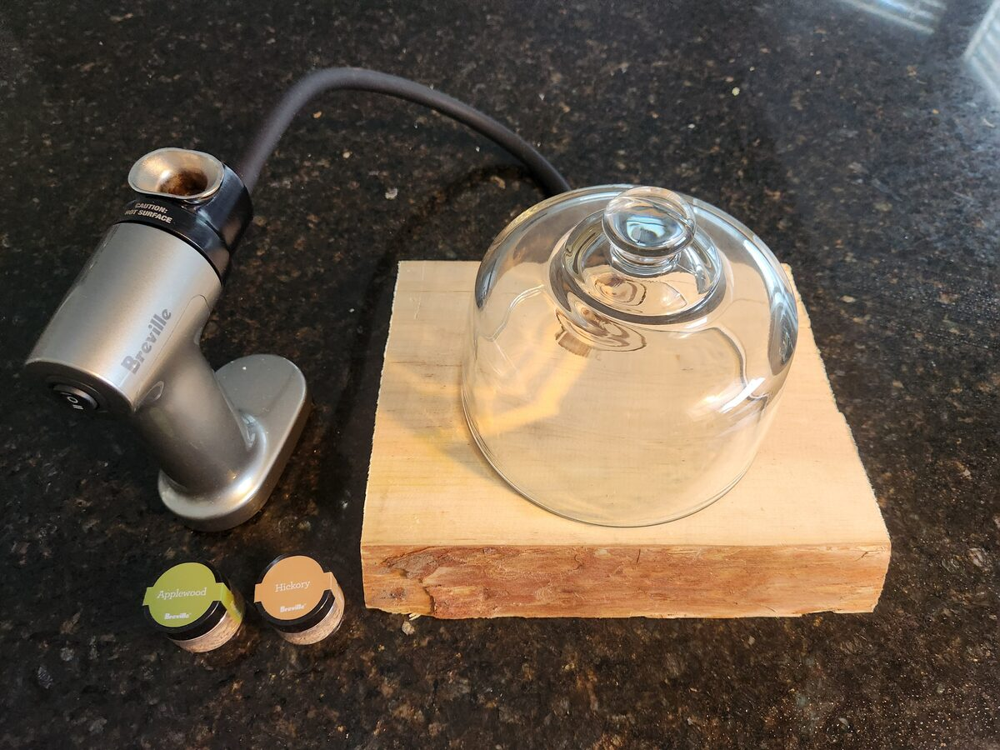
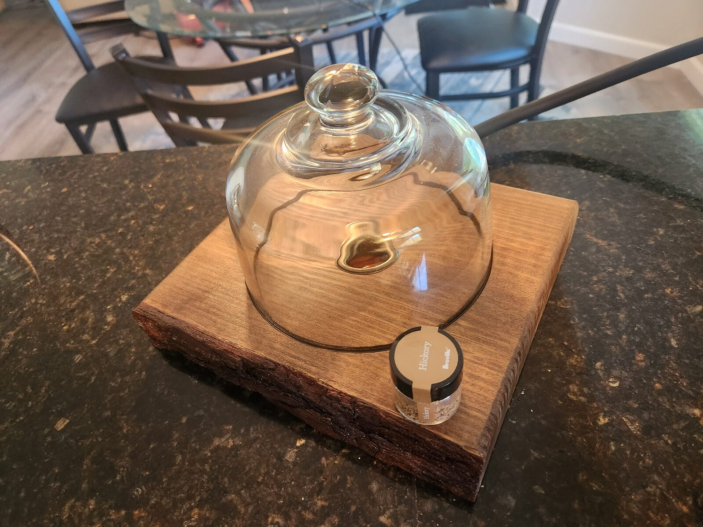

Sweetie got me a cold smoker for my birthday, but it didn't come with a vessel to hold the food being smoked — so naturally I got even more excited about the prospect of making one. This is a live edge wood base that pipes smoke up under a glass cloche. It took a birthday-night bowl prototype and a first cloche version to learn that smoke has a mind of its own; version two, with a copper smoke line and a round channel for the cloche, is far ahead of both. Almost to the finish line, but not quite — it still leaks a little under pressure.

## The idea

We both like to experiment with food and flavors, so a cold smoker was a perfect birthday gift. But it needed a proper base and something to hold the smoke over the food. The real design challenge was how to route the smoke in from underneath. As a kid, I'd made a root beer can lamp with two holes in the base for the cord, and it occurred to me that a similar approach could work here.

## What I did

Birthday night, we headed to Lowe's. I was thinking butcher's block for the base, but when we hit the lumber section we found live edge wood — even better. The long piece gave me multiple attempts to get it right, which turned out to be important. That same night I made a quick cut on the rough end and drilled two holes — one on top with a hole saw and one in the side — a super-quick first prototype. I figured out right away that a hole saw is only the right tool if you intend to go all the way through the board, but for the prototype it was good enough: it made a pathway for the smoke. We set a bowl upside down over the top hole and fired up the smoker. In my mind, the smoke would travel through the side hole and up into the bowl. In reality, the smoke went everywhere *except* under the bowl.

That's when the cloche came in. Prior to my 55 years of living, I didn't know the word "cloche" — but after describing what I wanted to my GPT friend, it knew exactly what I was after: a glass dome you can see through, with a proper rim to sit on the base.

That was version one. It looked the part, but the smoke still mostly went everywhere else rather than under the cloche. There was still no real channel for it — just holes through the wood — and wood is porous, so the smoke had plenty of places to escape.

Next came two practice pieces off the long board. The goals were to try a circle jig on the router, sized to match the cloche's diameter, to improve the center hole, and to experiment with copper pipe for the smoke line. With the cloche sitting in the trench, there was still some smoke leaking out, but it was an improvement over the original. The center hole where the smoke comes out also needed something to finish its look, though I wasn't sure what yet.

After all that practice cutting a smooth router circle and drilling to the right depths, I was ready to cut the final candidate from the end with the nice bark. There was one major issue: at that end, the board wasn't wide enough for the cloche. So it was back to the store for another long piece of live edge. Measure twice, cut once!

On the new board, I used the circle jig to cut a perfectly round 1/4" channel for the cloche to sit in. Then, instead of trusting the wood to carry the smoke, I fed a 1/2" copper pipe in from the back to the center of the base, where it meets a 1" copper end cap. The 1" auger bit had left the center hole rough, so the cap sits inside it to fill it in, with a 1/2" hole I drilled in it with a step bit for the lead-in pipe. The cap turns the smoke upward and out through the top, right in the middle under the glass, so it comes up exactly where the food is.

Then the finishing work. The live edge got shellac to protect the bark, and the top got three coats of butcher block stain. And the center hole finally got its answer: an antique brass grommet buttons up the hole on the top surface where the smoke comes out.

## What surprised me

Smoke follows the path of least resistance, and it's relentless about it. On birthday night and in version one, that path was through the porous wood instead of up under the glass. The copper line fixed that — now the smoke goes where it's supposed to. But once the cloche fills and there's a little pressure behind it, the smoke finds the next path of least resistance: out through the round channel under the rim.

## Result

The new design is far ahead of the original, and the live edge looks great with the shellac and stain. One more enhancement to go: lining the channel with silicone so the cloche seals against something softer than wood. Almost to the finish line, but not quite.

## Takeaways

- Smoke follows the path of least resistance — an unlined hole through wood doesn't create a directed channel, and once you pipe it properly, it will go looking for the next leak
- A long piece of live edge was a smart buy — multiple attempts built into one board
- Measure twice, cut once — check that the good-looking section is actually wide enough before you fall in love with it
- Quick birthday-night prototypes are great for validating (or invalidating) assumptions before committing to a finished build
- A circle jig makes a perfectly round channel easy — glass on wood still needs a gasket to seal
